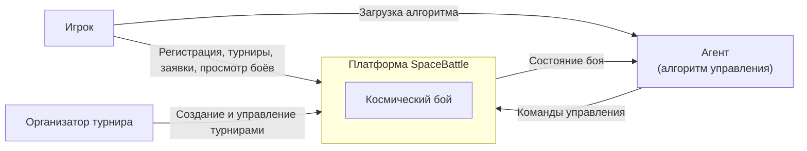
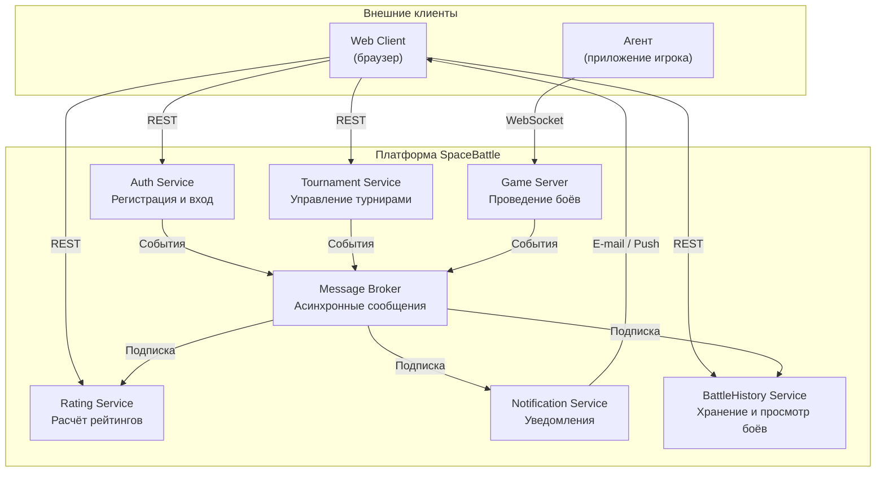

# Архитектура игры "Космический бой"

## Общее описание

Система "Космический бой" - платформа для проведения космических боев между игроками в рамках турниров и по договоренности. Игроки регистрируются, загружают алгоритм управления кораблями в приложение Агент и участвуют в боях. Турниры создаются пользователями, имеют рейтинг, могут быть регулярными.

Архитектура построена на микросервисах. Каждый сервис отвечает за одну бизнес-область и развертывается независимо. Сервисы общаются через синхронные REST-запросы (для операций, требующих немедленного ответа) и асинхронные события через Message Broker (для развязывания сервисов и надежности). Агент и Game Server используют WebSocket для обмена данными в реальном времени.

## Основные архитектурные решения

- Микросервисная архитектура. Сервисы изолированы, развертываются и масштабируются независимо.
- IoC-контейнер внутри сервисов. Команды и стратегии регистрируются через IoC, что позволяет расширять поведение без изменения кода (OCP).
- Асинхронный обмен событиями через Message Broker. Отправитель не знает получателей, можно добавлять новых подписчиков без изменения отправителей.
- WebSocket для связи Game Server с Агентом. Обеспечивает двусторонний обмен в реальном времени без накладных расходов на polling.
- CQRS для BattleHistory Service. Разделение хранилищ на запись и чтение позволяет оптимизировать каждое под свою нагрузку.
- Горизонтальное масштабирование Game Server. Бои изолированы, каждый экземпляр ведет свои бои.

## Диаграмма контекста системы (C4 Level 1)

## Диаграмма контейнеров - микросервисы (C4 Level 2)

## Взаимодействия между сервисами

### Синхронные запросы (REST)

| Источник | Получатель | Протокол | Описание |
|----------|------------|----------|----------|
| Web Client | Auth Service | REST | Регистрация, вход, получение токена |
| Web Client | Tournament Service | REST | Список турниров, подача заявки, результаты |
| Web Client | BattleHistory Service | REST | Просмотр записей прошедших боев |
| Web Client | Rating Service | REST | Таблица лидеров, рейтинг игрока или турнира |

### Реальное время

| Источник | Получатель | Протокол | Описание |
|----------|------------|----------|----------|
| Agent | Game Server | WebSocket | Команды управления кораблями |
| Game Server | Agent | WebSocket | Текущее состояние боя |

### Асинхронные события (через Message Broker)

| Отправитель | Событие | Получатели |
|-------------|---------|------------|
| Auth Service | Пользователь зарегистрирован | Notification Service, Rating Service |
| Tournament Service | Турнир создан | Notification Service |
| Tournament Service | Заявка одобрена / отклонена | Notification Service |
| Tournament Service | Турнир завершен | Rating Service, Notification Service |
| Game Server | Бой завершен | BattleHistory Service, Rating Service, Notification Service |
| Game Server | Бой скоро начнется | Notification Service |

## Изменчивые компоненты и применение OCP

### 1. Rating Service - формулы расчета рейтинга

**Что может меняться.** Алгоритм расчета рейтинга: бонус за серию побед, штраф за неактивность и т.д.

**Как применен OCP.** Rating Service принимает события через брокер (бой завершен, турнир завершен) и вызывает стратегию расчета. Стратегия регистрируется через IoC по ключу `Rating.Algorithm`. Для смены алгоритма достаточно зарегистрировать новую стратегию, сам сервис не меняется. Разные турниры могут использовать разные алгоритмы одновременно.

### 2. Notification Service - каналы доставки уведомлений

**Что может меняться.** Способы доставки уведомлений: email, push, Telegram-бот, WebSocket в браузере.

**Как применен OCP.** Notification Service принимает унифицированное событие (тип уведомления, получатель, данные) и передает его в цепочку обработчиков. Каждый канал доставки - отдельный обработчик, зарегистрированный в IoC. Новый канал добавляется регистрацией нового обработчика, существующие не меняются.

### 3. Game Server - правила игры и команды

**Что может меняться.** Игровые механики: новые типы движения, столкновения, оружие, бонусы и т.д.

**Как применен OCP.** Новые команды регистрируются в IoC. InterpretCommand получает operationId из сообщения, находит команду через `Game.Operation.Resolve`, создает через `Game.Command.Create`. Добавление новой команды не требует изменения ни MessageEndpoint, ни InterpretCommand, ни Game Server.