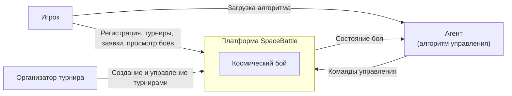

# Архитектура игры "Космический бой"

## Диаграмма контекста системы (C4 Level 1)

```mermaid
flowchart LR
    Player["Игрок"]
    Organizer["Организатор турнира"]
    Agent["Агент\n(алгоритм управления)"]

    subgraph System["Платформа SpaceBattle"]
        SB["Космический бой"]
    end

    Player -->|"Регистрация, турниры, заявки, просмотр боёв"| System
    Organizer -->|"Создание и управление турнирами"| System
    Player -->|"Загрузка алгоритма"| Agent
    System -->|"Состояние боя"| Agent
    Agent -->|"Команды управления"| System
```