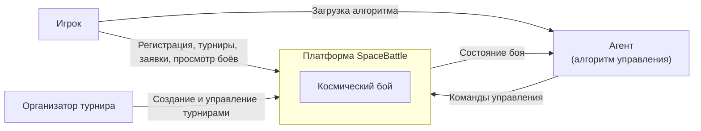
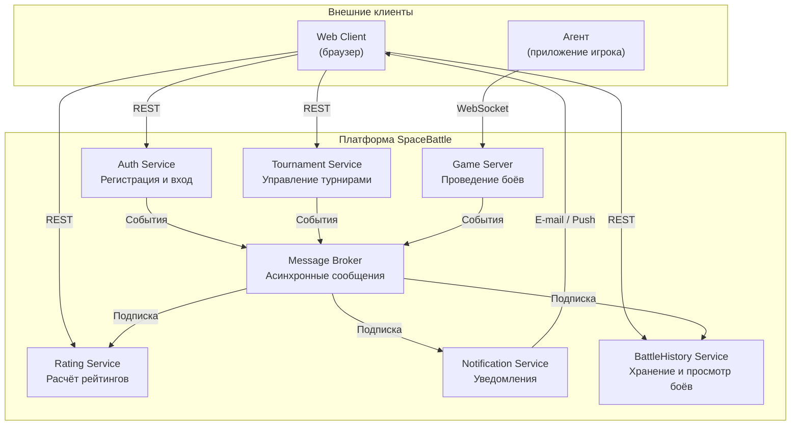

# Архитектура игры "Космический бой"

## Диаграмма контекста системы (C4 Level 1)

## Диаграмма контейнеров - микросервисы (C4 Level 2)

## Взаимодействия между сервисами

### Синхронные запросы (REST)

| Источник | Получатель | Протокол | Описание |
|----------|------------|----------|----------|
| Web Client | Auth Service | REST | Регистрация, вход, получение токена |
| Web Client | Tournament Service | REST | Список турниров, подача заявки, результаты |
| Web Client | BattleHistory Service | REST | Просмотр записей прошедших боев |
| Web Client | Rating Service | REST | Таблица лидеров, рейтинг игрока или турнира |

### Реальное время

| Источник | Получатель | Протокол | Описание |
|----------|------------|----------|----------|
| Agent | Game Server | WebSocket | Команды управления кораблями |
| Game Server | Agent | WebSocket | Текущее состояние боя |

### Асинхронные события (через Message Broker)

| Отправитель | Событие | Получатели |
|-------------|---------|------------|
| Auth Service | Пользователь зарегистрирован | Notification Service, Rating Service |
| Tournament Service | Турнир создан | Notification Service |
| Tournament Service | Заявка одобрена / отклонена | Notification Service |
| Tournament Service | Турнир завершен | Rating Service, Notification Service |
| Game Server | Бой завершен | BattleHistory Service, Rating Service, Notification Service |
| Game Server | Бой скоро начнется | Notification Service |